# Custom Product Attribution System: Technical Documentation

Welcome to the technical developer documentation for the **Custom Product Attribution System** Odoo module. This system extends Odoo's product catalog with a hybrid Entity-Attribute-Value (EAV) model, category-based attribute inheritance, default value resolution, and a dynamic OWL rendering component.

This documentation serves as the technical entry point and architecture overview. If you are looking for configuration steps, import guide, or user manual, please check the **[User Guide Index](file:///c:/Users/nonna/Dev/repository/odoo_product_attribution_system/docs/user_guide.md)**.

Detailed, specialized technical information is organized across modular guides inside the `docs/` folder.

---

## 🗺️ Documentation Directory

Use the following links to navigate the detailed technical guides:

1. **[Architecture & Traversal Logic](file:///c:/Users/nonna/Dev/repository/odoo_product_attribution_system/docs/architecture.md)**
   * Recursive category attribute inheritance, computation caching, performance considerations, and cycle prevention.
2. **[Data Models & EAV Schema](file:///c:/Users/nonna/Dev/repository/odoo_product_attribution_system/docs/models.md)**
   * DB mappings for `product.attribute`, `product.attribute.set`, and `product.template.custom.value`. Resolution hierarchy for attribute default values.
3. **[OWL Widget Component](file:///c:/Users/nonna/Dev/repository/odoo_product_attribution_system/docs/owl_widget.md)**
   * Code structure and template rendering logic for `DynamicAttributeValueField`, type-based dynamic rendering, and writeback logic.
4. **[Testing Suite & Coverage Guide](file:///c:/Users/nonna/Dev/repository/odoo_product_attribution_system/docs/testing.md)**
   * Unit and integration testing strategy, post-install HttpCase setups, Boundary Value Analysis (BVA), and testing execution guide.

---

## 🏗️ High-Level System Architecture

The following diagram illustrates how product attributes are inherited by categories and templates, resolved with their respective default values, stored via the EAV custom values lines, and dynamically rendered in backend Odoo list/form views:

```mermaid
graph TD
    classDef model fill:#f9f,stroke:#333,stroke-width:2px;
    classDef view fill:#bbf,stroke:#333,stroke-width:2px;
    classDef owl fill:#f96,stroke:#333,stroke-width:2px;

    %% Models
    PA[product.attribute]:::model -->|Has value_type: text, integer, float, date, boolean, selection| PASL[product.attribute.set.line]:::model
    PAS[product.attribute.set]:::model -->|Contains lines| PASL
    
    PC[product.category]:::model -->|Inherits parent attributes| PC
    PC -->|Has attribute_ids & attribute_set_ids| PA
    PC -->|all_inherited_attribute_ids computed recursively| PA
    PC -->|Syncs selectively to channels| POSC[pos.category]:::model
    PC -->|Syncs selectively to channels| WEBC[product.public.category]:::model
    
    PT[product.template]:::model -->|Refers to categ_id & attribute_set_ids| PT
    PT -->|Syncs custom values| PTCV[product.template.custom.value]:::model
    PT -->|Has state: draft, enriching, approved| PIMWorkflow[PIM State Machine]
    PT -->|PIM Assets| PIMA[product.pim.asset]:::model
    
    PIMA -->|References| IRA[ir.attachment]:::model
    
    PTCV -->|References| PA
    PTCV -->|EAV Fields: value_text, value_integer, value_float, value_date, value_boolean, value_selection_id| PTCV
    
    %% Defaults Resolution
    PT -.->|1. Query template attribute_set_ids| PASL
    PT -.->|2. Query category tree hierarchy attribute_set_ids| PASL
    
    %% Export Profile
    PEP[pim.export.profile]:::model -->|Contains mappings| PEM[pim.export.mapping]:::model
    PEM -->|Maps core fields and EAV custom values| PT
    PEP -->|Generates Approved Products Feed| Down[CSV/JSON Download File]
    
    %% View Layer
    PTV["Product Form View <Specifications Tab>"]:::view -->|Loads grid of| PTCV
    PTV -->|Applies widget| OWL["dynamic_attribute_value OWL Widget"]:::owl
    
    %% Widget rendering
    OWL -->|If readonly| Display[Renders display_value text]
    OWL -->|If edit text| InputText[Text input]
    OWL -->|If edit integer| InputInt[Number input step=1]
    OWL -->|If edit float| InputFloat[Number input step=any]
    OWL -->|If edit date| InputDate[Date calendar picker]
    OWL -->|If edit boolean| InputBool[Checkbox form-check-input]
    OWL -->|If edit selection| SelectDropdown[Dropdown menu loaded from product.attribute.value]

    %% Writeback
    InputText -->|on-change event| Writeback[Triggers update on record EAV fields]
    InputInt -->|on-change event| Writeback
    InputFloat -->|on-change event| Writeback
    InputDate -->|on-change event| Writeback
    InputBool -->|on-change event| Writeback
    SelectDropdown -->|on-change event| Writeback
```



---

## 🔒 PIM Governance & Security Constraints

The PIM module implements strict data verification and catalog lifecycle locking:

### 1. Completeness Validation
* **Composite Score Calculation**: Calculated recursively dynamically (without db storage overhead) combining standard core fields (Name, Description, Main Image, Product Category) and custom EAV attributes flagged as `is_required` (globally or within assigned Sets).
* **Validation Check**: Transition from `Enriching` to `Approved` is gated. If the score is less than `100%`, a `ValidationError` prevents the transaction.

### 2. State Edit Locks
* **Write/Delete Locking**: Once a template enters the `Approved` state, the parent `product.template` and its children EAV `product.template.custom.value` records are write-locked in the backend. 
* **State Override**: To modify details, the stage must be explicitly transitioned back to `Draft` or `Enriching` using the state transitions header.

---

## 📁 Repository Layout & File Roles

The system is modularized as follows:

```text
odoo_product_attribution_system/
├── __manifest__.py                 # Module configuration and depends on ['product', 'sale']
├── data/
│   └── demo_data.xml               # Home Improvement wholesaler demo records
├── models/
│   ├── product_attribute.py        # Adds value_type selection to attributes
│   ├── product_attribute_set.py    # Sets and default value schemas
│   ├── product_category.py         # Category inheritance logic & template synchronization
│   ├── product_template.py         # Template integration & default value resolvers
│   ├── product_template_custom_value.py # EAV model for storing custom attributes per product
│   ├── pim_asset.py                # Digital asset model (DAM) for attachments and video links
│   ├── pim_export.py               # Feed export profiles & mappings generator (CSV/JSON)
│   └── res_config_settings.py      # PIM application transient settings configuration
├── security/
│   ├── security_groups.xml         # Declares PIM Operator & PIM Manager groups
│   └── ir.model.access.csv         # Access control lists (ACL) for custom models
├── static/
│   └── src/
│       └── components/
│           ├── dynamic_attribute_value_field.js   # OWL controller and writeback event handlers
│           └── dynamic_attribute_value_field.xml  # OWL template switching inputs on-the-fly
├── tests/
│   └── test_product_attribution.py # Complete integration test suite (Happy & Edge cases)
└── views/
    ├── product_attribute_set_views.xml  # Views & menus for Attribute Sets
    ├── product_attribute_views.xml      # Extends attribute form with value_type selection
    ├── product_category_views.xml       # Extends category form with attributes & sets
    ├── product_template_views.xml       # Extends product form with EAV grid Specifications tab
    ├── pim_export_views.xml             # Views, menus, and actions for Export Profiles
    └── res_config_settings_views.xml    # Standalone PIM App configuration panel views
```

For detailed specifications of any of these components, please refer to the corresponding sub-documents in the **Documentation Directory** above.
