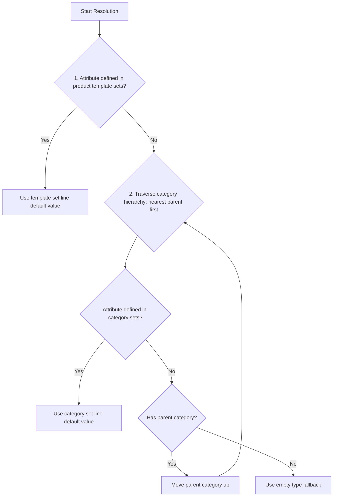

# Data Models & EAV Schema

This document details the database schema, models, constraints, and default value resolution logic for the Custom Product Attribution System.

---

## 1. Model Schemas & Fields

The module introduces or extends five core Odoo models:

### 1.1 `product.attribute` (Inherited)
Extends the standard product attribute model with typed value configuration.
* **`value_type`** (`fields.Selection`): Defines the expected data type for values. Options:
  * `text`: Multi-line text block.
  * `integer`: Standard integer.
  * `float`: Standard decimal float.
  * `date`: Calendar date.
  * `boolean`: Yes/No checkbox.
  * `selection`: Dropdown options mapped to `product.attribute.value` records.

### 1.2 `product.attribute.set` (New)
Defines a reusable group of attributes with pre-configured default values.
* **`name`** (`fields.Char`): Set identifier (e.g. *Electronics Specifications*).
* **`attribute_line_ids`** (`fields.One2many`): Link to set line details.

### 1.3 `product.attribute.set.line` (New)
Detailed lines within a set specifying defaults per attribute.
* **`set_id`** (`fields.Many2one`): Relation to the parent set.
* **`attribute_id`** (`fields.Many2one`): Relation to `product.attribute`.
* **`value_type`** (`fields.Selection`): Related/stored type.
* **Default Value Fields** (EAV fields for setting defaults):
  * `value_text` (`fields.Text`)
  * `value_integer` (`fields.Integer`)
  * `value_float` (`fields.Float`)
  * `value_date` (`fields.Date`)
  * `value_boolean` (`fields.Boolean`)
  * `value_selection_id` (`fields.Many2one` pointing to `product.attribute.value`)
* **`display_value`** (`fields.Char`): Computed string representation of the active default value (used in lists and search).

### 1.4 `product.category` (Inherited)
Links categories to attributes and sets.
* **`attribute_ids`** (`fields.Many2many`): Direct category attributes.
* **`attribute_set_ids`** (`fields.Many2many`): Direct category sets.
* **`all_inherited_attribute_ids`** (`fields.Many2many`): Dynamically computed aggregation of direct and parent-category attributes.

### 1.5 `product.template` (Inherited)
Integrates specifications grid and set configurations on product templates.
* **`custom_value_ids`** (`fields.One2many`): Relation to custom value lines.
* **`attribute_set_ids`** (`fields.Many2many`): Sets assigned specifically to this template.
* **`all_inherited_attribute_ids`** (`fields.Many2many`): Merged category & template sets attributes.

### 1.6 `product.template.custom.value` (New)
Stores custom specification values per product template using an EAV database layout.
* **`product_tmpl_id`** (`fields.Many2one`): Relation to `product.template`.
* **`attribute_id`** (`fields.Many2one`): Relation to `product.attribute`.
* **`value_type`** (`fields.Selection`): Related/stored type.
* **EAV Value Storage Fields**:
  * `value_text` (`fields.Text`)
  * `value_integer` (`fields.Integer`)
  * `value_float` (`fields.Float`)
  * `value_date` (`fields.Date`)
  * `value_boolean` (`fields.Boolean`)
  * `value_selection_id` (`fields.Many2one` pointing to `product.attribute.value`)
* **`display_value`** (`fields.Char`): Computed string representation of the saved EAV value.
* **`is_inherited`** (`fields.Boolean`): Computed flag showing if the attribute is currently inherited by the template's active category or template sets.
* **`is_visible`** (`fields.Boolean`): Computed flag indicating if the attribute should be visible based on active conditional rules.
* **`is_readonly`** (`fields.Boolean`): Computed flag indicating if the attribute should be read-only based on active conditional rules.

### 1.7 `product.attribute.set.rule` (New)
Defines conditional dependency rules to filter, hide, disable, or force target values.
* **`set_id`** (`fields.Many2one`): Relation to the parent `product.attribute.set`.
* **`attribute_id`** (`fields.Many2one`): Trigger attribute (must belong to the set).
* **Trigger Conditions**:
  * `condition_value_selection_ids` (`fields.Many2many` to `product.attribute.value`): Trigger selection options.
  * `condition_value_boolean` (`fields.Boolean`): Trigger boolean state.
  * `condition_value_text` (`fields.Char`): Trigger text value matches.
* **`action_type`** (`fields.Selection`): Action to apply: `hide`, `readonly`, `set_value`.
* **`target_attribute_id`** (`fields.Many2one`): Affected target attribute (must belong to the set, trigger != target).
* **Action Values** (for `set_value` action):
  * `action_value_text`
  * `action_value_integer`
  * `action_value_float`
  * `action_value_date`
  * `action_value_boolean`
  * `action_value_selection_id` (pointing to target `product.attribute.value`)

---

## 2. Integrity & Database Constraints

The module enforces strict constraints to preserve data consistency:

* **Selection Value Constraint**: Selection values must belong to the matching attribute.
  ```python
  @api.constrains('value_selection_id', 'attribute_id')
  def _check_selection_value(self):
      for rec in self:
          if rec.value_selection_id and rec.value_selection_id.attribute_id != rec.attribute_id:
              raise ValidationError("The selection value must belong to the same attribute!")
  ```
* **Unique Set Attribute**: SQL constraint preventing duplicate attributes in a set.
  `('uniq_set_attribute', 'unique(set_id, attribute_id)', 'An attribute can only be defined once per attribute set!')`
* **Unique Template Attribute**: SQL constraint preventing duplicate custom values per template.
  `('uniq_product_attribute', 'unique(product_tmpl_id, attribute_id)', 'An attribute custom value line must be unique per product template!')`

---

## 3. Default Value Resolution Hierarchy

When a custom value line is initialized on a product template, the system resolves its default value using a specific hierarchy:



This resolution algorithm is implemented in [models/product_template.py](file:///c:/Users/nonna/Dev/repository/odoo_product_attribution_system/models/product_template.py#L38-L62):

```python
    def _get_attribute_default_value(self, attribute):
        self.ensure_one()
        # 1. Check template-specific sets
        for set_rec in self.attribute_set_ids:
            line = set_rec.attribute_line_ids.filtered(lambda l: l.attribute_id == attribute)
            if line:
                return line[0]

        # 2. Check category hierarchy sets
        if self.categ_id:
            visited = {self.categ_id.id}
            curr_categ = self.categ_id
            while curr_categ:
                for set_rec in curr_categ.attribute_set_ids:
                    line = set_rec.attribute_line_ids.filtered(lambda l: l.attribute_id == attribute)
                    if line:
                        return line[0]

                curr_categ = curr_categ.parent_id
                if curr_categ and curr_categ.id in visited:
                     break
                if curr_categ:
                     visited.add(curr_categ.id)
        return None
```
